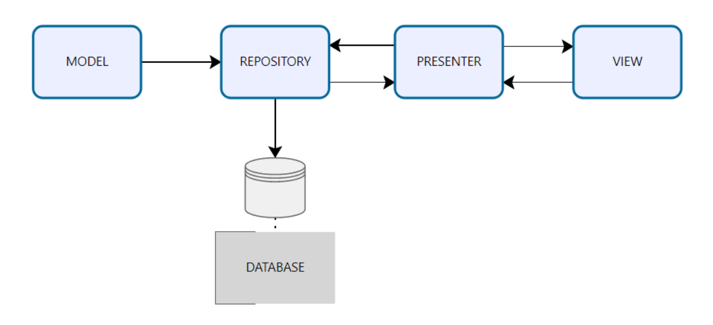
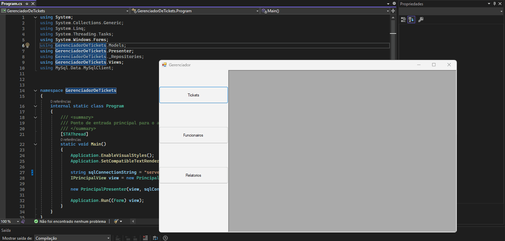
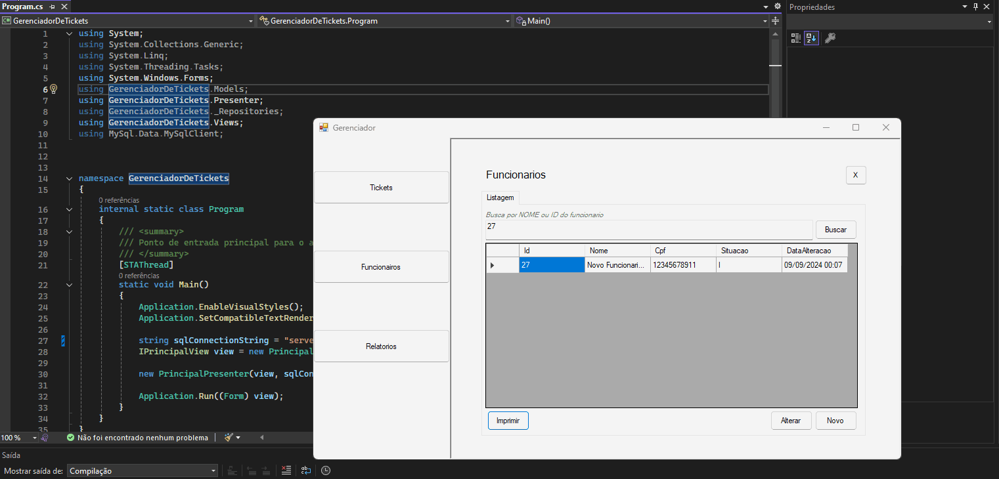

# Gerenciador de Tickets

Projeto para um gerenciador de Tickets entregues refeição. 

O projeto foi desenvolvido utilizando:

- Liguagem de programação `C#` juntamente com `.NET framework 4.8`.

- Banco de dados `MySQL(Mariadb)`

- Microsoft Report Viewer para e emissão dos relatorios.

A estrutura do projeto foi construída se baseando no modelo MVP(Model-View-Presenter)

## Funcionalidades

- Criar, editar, listar, buscar(por nome, e id do funcionário) e imprimir funcionários.
- Criar, editar, listar e buscar(por nome de funcionário, e id do ticket) tickets entregues
- Emitir relatório de ticketes entregues por período.

## Requisitos
- .NET framewor 4.8 instaldo na maquina.
- Visual Studio instalado com a opção (.NET desktop development).

## Configuração do projeto

Para executar este projeto, você pode precisar adicionar as seguintes configurações no Projeto/Visual Studio.
  
#### Referências adicionados ao projeto
    System.ComponentModel.DataAnnotations

#### Pacotes instalados projeto
    MySQL.Data

    Microsoft.ReportingServices.ReportViewerControl.Winforms(versão 140.1000.523)
#### Extensões do Visual Studio
    Microsoft RDCL Report Designer

#### Banco de dados
A variavel que guarda a `string` de conexão com o banco de dados fica dentro do arquivo `Program.cs` localizado na raiz do projeto.
Altere os valores conforme a configuração do seu banco de dados:
    
    string sqlConnectionString = "server=localhost;user=root;password=1234;database=gerenciador;";

A string acima contém os parâmetros para a conexão com o MySQL. Se você utiliza outra versão, como o MySQL Server, esses parâmetros podem mudar e precisarão ser ajustados.

Na pasta Banco, na raiz do repositório, estão disponíveis o SQL para criação do banco (gerenciador.sql) e alguns inserts nas tabelas (inserts.sql).

## Demonstração

#### Tela de Funcionario

#### Tela de Tickets

#### Tela de Relatorio

## Autor

- [@André Leiria](https://github.com/Alrs-Leiria)

